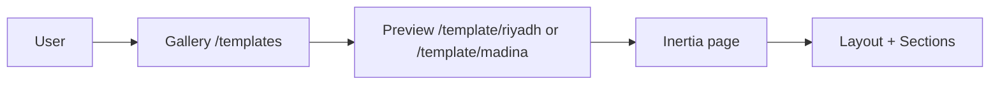

# Templates System

## What Are Templates

Templates are full-page “skins” for hotel (or furnished-apartment) sites. Each template includes:

- A **layout** (header, footer, main area).
- **Sections**: Hero, Rooms, Services, Partners, Testimonials, Gallery, Contact (and optionally more, e.g. Additional Services).
- Its own **styles**, **data**, and **translations** where applicable.

Templates are **self-contained**: they do not depend on each other. For example, the Madina template uses its own layout, header, footer, and CSS variables; it does not import from the Riyadh template.

---

## How Templates Are Exposed

### Gallery

Users browse templates on the public **Templates** page:

- **Page**: `resources/js/pages/public/Templates.tsx`
- **Data**: `resources/js/components/public/templates/constants.ts` – `TEMPLATES` (list of template items with id, image, title key, region) and `FILTERS` (region keys: all, madinah, makkah, hijaz, central, sulamani).

Filtering is by region; each item can link to a preview URL (e.g. `/template/madina` or `/template/riyadh`).

### Preview Routes

Template previews are registered in `routes/web.php` under the `template` prefix:

| URL | Inertia page | Translations |
|-----|--------------|---------------|
| `/template/riyadh` | `templates/Riyadh/index` | `__('templates', [], locale)` |
| `/template/madina` | `templates/Madina/index` | `trans('madina', [], $locale)` |

Both pass `templateTranslations` to the page. Madina also receives `locale`.

Flow:



---

## Riyadh Template

- **Layout**: `resources/js/layouts/TemplateLayout.tsx` – shared header and footer for template pages.
- **Page**: `resources/js/pages/templates/Riyadh/index.tsx` – composes: HeroSection, RoomsSection, ServicesSection, PartnersSection, TestimonialsSection, GallerySection, GallerySlider, ContactSection.
- **Translations**: Laravel passes `__('templates', [], locale)` as `templateTranslations`. Keys are nested (e.g. header, footer, sections).
- **CSS class**: `template--riyadh` on the main wrapper.

---

## Madina Template

### Layout and Structure

- **Layout**: `resources/js/layouts/MadinaLayout.tsx` – custom layout with:
  - **Header**: `resources/js/pages/templates/Madina/MadinaHeader.tsx`
  - **Footer**: `resources/js/pages/templates/Madina/MadinaFooter.tsx`
  - **Theme switcher**: `resources/js/components/templates/ThemeSwitcher.tsx` (floating panel for theme/section-style options).
- **Page**: `resources/js/pages/templates/Madina/index.tsx` – sections: Hero, Rooms, Services, Partners, Additional Services, Testimonials, Gallery, Contact.

### Translations

- Laravel passes `trans('madina', [], $locale)` as `templateTranslations` in the route. The `LoadMadinaTranslations` middleware can also share Madina translations with Inertia for other uses.
- Language file: `resources/lang/ar/madina.php` and `resources/lang/en/madina.php`.

### Styles

- **File**: `resources/css/templates/madina.css`
- **Variables**: `--madina-*` (e.g. primary, secondary, spacing, typography). The template wrapper uses the class `template--madina`.

### Config

- **File**: `resources/js/config/templates/madina.config.ts`
- **Contents**: Theme colors, image paths, typography, spacing. Used by the Madina template and by the config/usage example.

### Data

- **Folder**: `resources/js/data/templates/madina/`
- **Files**: e.g. `index.ts`, `hero-data.ts`, `rooms-data.ts`, `services-data.ts`, `partners-data.ts`, `testimonials-data.ts`, `gallery-data.ts`, `contact-data.ts`, `stats-data.ts`. Each section can import what it needs.

### ThemeSwitcher

The Madina template includes a **ThemeSwitcher** component. It allows users to customize:

- **Identity theme** – primary + light/dark backgrounds in one set.
- **Colors** – primary, secondary, background (light and dark).
- **Section styles** – header, hero slider, room cards, service cards, partners, additional services, testimonials, gallery, contact form.
- **Fonts** – family and heading options.
- **Header** – e.g. border radius.

Settings are stored in **localStorage** and applied via CSS variables and class names. No backend call is required for theme persistence.

---

## Using Translations in Templates

- **Hook**: `useTemplateT()` from `resources/js/hooks/useTemplateTranslations.ts`.
- **Behavior**: Reads `templateTranslations` from the Inertia page props and returns a function `t(key, fallback)`. Keys are dot-separated and nested (e.g. `sections.hero.title`, `header.nav.home`).
- **Example**:

  ```tsx
  const t = useTemplateT()
  return <h1>{t('sections.hero.title', 'Welcome')}</h1>
  ```

- **Source of data**: The route controller passes `templateTranslations` from Laravel. Riyadh uses the `templates` lang file; Madina uses the `madina` lang file.

---

## Adding a New Template

1. **Route** – In `routes/web.php`, add a new route under `Route::prefix('template')`, e.g. `Route::get('/my-template', ...)`. Return an Inertia page and pass `templateTranslations` (and optionally `locale`).
2. **Page** – Create `resources/js/pages/templates/MyTemplate/index.tsx` that renders a layout and sections.
3. **Layout** – Reuse `TemplateLayout` or create a dedicated layout (e.g. `MyTemplateLayout`) with its own header/footer if needed.
4. **Translations** – Add lang entries (e.g. `resources/lang/ar/my_template.php`) and pass them as `templateTranslations` in the route.
5. **Gallery (optional)** – Add an entry to `TEMPLATES` in `resources/js/components/public/templates/constants.ts` and link the preview button to `/template/my-template`.

Optionally add template-specific CSS (e.g. `resources/css/templates/my-template.css`) and a config or data folder under `resources/js/config/templates/` or `resources/js/data/templates/`.
